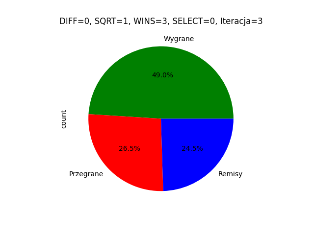
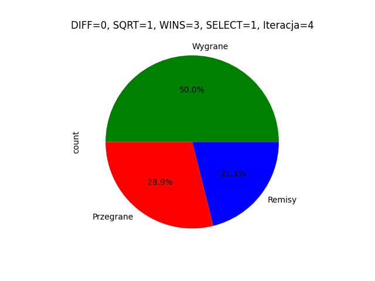

## Wynik analizy wydajności botów

---

Pojedynki odbywały się zawsze pomiędzy 2 różnymi typami botów. Łączna ilość symulacji to 200. Wszystkie cztery boty zostaly przystosowane do gry w super tic tac toe (opcja gry na większej planszy).

### bot normal

### bot hard

### bot impopable

### bot random

Jak widać bot grający randomowo nie radzi sobie z botami grającymi mądrze. Bot impopable gra znacznie lepeiej od innych botów i może być godnym przeciwnikiem dla człowieka.

